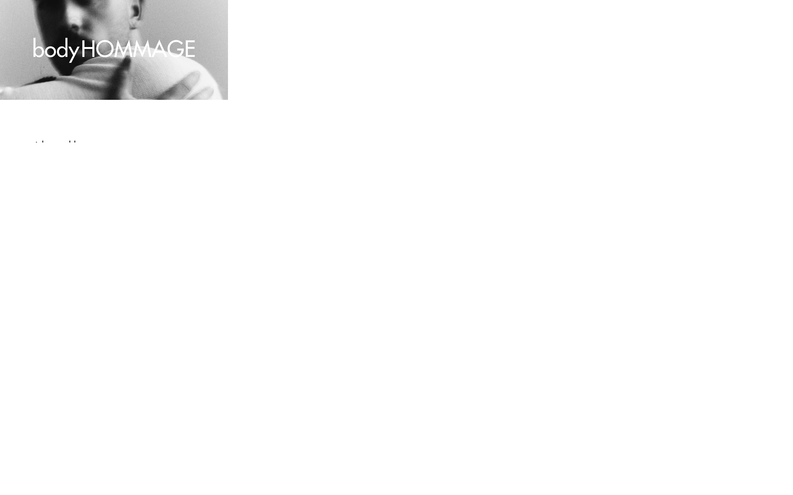

# bodyHOMMAGE

A responsive digital experience designed and developed for bodyHOMMAGE.

I was responsible for the original web design as well as its frontend implementation, translating the brand into an image-led digital experience across desktop and mobile.



## My role

**Web Design · UX/UI · Front-End Development**

I designed the digital experience from the ground up and then translated that design into a responsive React implementation.

The project included:

- Visual direction and web design
- Information hierarchy and page composition
- Typography and spacing
- Responsive UX/UI
- Image-led layouts
- Reusable React components
- Frontend implementation across desktop and mobile

Working across both design and development meant the interface could evolve directly in the browser rather than treating design and implementation as separate handoff stages.

## Built with

- React
- Vite
- CSS

## Run locally

```sh
npm install
npm run dev
```

## Live

[bodyhommage.com](https://bodyhommage.com/)

## More work

See selected design and software projects at [halfodd.com](https://www.halfodd.com/).

## License

All rights reserved.
